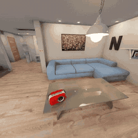

# VLA Policy Benchmark on BEHAVIOR-1K

**BEHAVIOR-1K `turning_on_radio` 태스크에서 9개 VLA 정책을 동일 조건으로 closed-loop 평가한 벤치마크 하네스와 그 결과.**

GR00T N1.7 / π0 계열 정책을 대상으로 LoRA vs 풀 파인튜닝, 사전학습 폭, diffusion denoising step 수를 비교했다.
핵심 결론은 **training loss가 정상적으로 하강해도 closed-loop 성공률은 붕괴할 수 있다**는 것이다.

> *A reproducible closed-loop evaluation harness comparing 9 VLA policies on the BEHAVIOR-1K
> `turning_on_radio` task, with raw metrics included so every number in this README can be regenerated.*

**목차** · [결과](#결과) · [영상 비교](#같은-인스턴스-세-가지-결과) · [핵심 관찰](#핵심-관찰) · [한계](#한계) · [내가 만든 것](#이-저장소에서-내가-만든-것) · [재현](#재현)

---

## 결과

| 정책 | 성공률 | 성공 인스턴스 |
|---|---|---|
| **pt50 + LoRA 10k** | **4/10** | 109, 139, 203, 242 |
| pt12 + LoRA 10k | 3/10 | 211, 214, 242 |
| pt50 원본 (50-task 사전학습) | 3/10 | 181, 211, 242 |
| RLC checkpoint_2 원본 | 3/10 | 139, 181, 187 |
| pt12 원본 (12-task 사전학습) | 1/10 | 139 |
| GR00T N1.7 파인튜닝 10k (K=4) | 0/10 | — |
| GR00T N1.7 파인튜닝 10k (K=8) | 0/10 | — |
| RLC 풀 파인튜닝 step 5k | 0/10 | — |
| RLC 풀 파인튜닝 step 20k | 0/10 | — |

평가 조건: OmniGibson closed-loop / 10개 고정 태스크 인스턴스(109·139·181·187·197·203·211·214·242·295) / RGBWrapper / websocket 정책 서버.
성공 판정은 `q_score.final == 1.0`.

이 표는 저장소에 포함된 원본 메트릭에서 재생성할 수 있다.

```bash
python scripts/aggregate_metrics.py --markdown
```

자세한 분석은 [RESULTS.md](RESULTS.md).

---

## 같은 인스턴스, 세 가지 결과

**인스턴스 242**에서 세 정책의 헤드 카메라. 동일 시작 상태이며, 각 에피소드 전체를 압축했다.

| pt50 + LoRA — **성공** | GR00T N1.7 FT — **미수렴** | RLC 풀 FT — **정책 붕괴** |
|:---:|:---:|:---:|
|  |  |  |
| 라디오에 접근해 파지·조작 | 대상 근처까지는 가나 조작 실패 | 대상과 무관한 공간을 배회 |
| **1349 step 종료** | 4300 step 타임아웃 | 4300 step 타임아웃 |
| 5배속 | 16배속 | 16배속 |

> **성공 판정은 시뮬레이터 상태(`q_score`)로 이루어진다.** 라디오의 토글 상태가 바뀌었는지를 보는 것이라,
> 영상만으로는 성공 순간이 극적으로 드러나지 않는다. 육안으로 확실한 신호는
> **에피소드 종료 시점**이다 — 성공하면 타임아웃(4300) 전에 끝나고, 실패하면 전부 4300까지 간다.

가운데와 오른쪽은 결과가 똑같이 0/10이지만 실패 방식이 다르다.
가운데는 태스크를 시도하다 못 끝낸 것이고, 오른쪽은 태스크와 무관한 궤적을 생성한다.
이 차이는 이동량 수치로도 확인된다 — [관찰 4](#4-같은-010도-실패-방식이-다르다).

---

## 핵심 관찰

### 1. loss는 내려가는데 성공률은 0이 된다

RLC checkpoint_2는 파인튜닝 전 3/10이었다. 여기에 1등팀 레시피를 적용해 풀 파인튜닝하자 **0/10**이 됐다.
이때 **training loss는 0.50까지 정상적으로 하강**했다.

원 레시피는 global batch 2048이지만, 가용 GPU 제약으로 batch 32까지 축소해서 돌렸다.
LR을 sqrt 스케일링(1e-4 → 2.5e-5)해도 복구되지 않았다.

**배치 크기 축소를 가장 유력한 원인으로 보고 있으나, 배치 크기만 바꾼 통제 실험은 하지 못했다**
(batch 2048을 돌릴 GPU가 없었다). 따라서 이는 인과 규명이 아니라, 다른 조건을 동일하게 두고
축소 재현을 시도했을 때 관찰된 결과다.

> 확실하게 말할 수 있는 것은 이것이다 — **오프라인 loss는 정상이었고 closed-loop 성공률은 3/10에서 0/10이 됐다.**
> 같은 체크포인트의 before/after 비교이므로, 성능 저하가 파인튜닝 과정에서 발생했다는 것까지는 좁혀진다.

*loss 값은 wandb offline run 기록에서 온 것이며, 곡선 자체는 이 저장소에 포함되어 있지 않다.*

### 2. LoRA는 일관되게 도움이 된다

같은 태스크에서 LoRA 10k step 파인튜닝은 두 베이스 모델 모두에서 성능을 올렸다.

| 베이스 | 원본 | +LoRA |
|---|---|---|
| pt12 | 1/10 | **3/10** |
| pt50 | 3/10 | **4/10** |

관찰 1과 함께 보면, 이 데이터 규모에서는 **파라미터 전체를 흔드는 것보다 저랭크 어댑터로 제한하는 쪽이 안전**하다.

### 3. 사전학습 폭이 파인튜닝만큼 작용한다

파인튜닝 없이도 pt50 원본(50-task 사전학습)이 3/10, pt12 원본(12-task)이 1/10이었다.

| | 성공률 |
|---|---|
| pt12 원본 | 1/10 |
| pt12 + LoRA 파인튜닝 | 3/10 |
| **pt50 원본 (파인튜닝 없음)** | **3/10** |

**넓게 사전학습한 모델은 파인튜닝 없이도, 좁게 사전학습 후 파인튜닝한 모델과 같은 수준에 도달했다.**
두 요인의 기여가 이 실험에서는 각각 +2로 같았다. 표본이 작아 우열을 가릴 수는 없지만,
사전학습 폭이 단일 태스크 파인튜닝에 필적하는 크기의 요인이라는 점은 확인된다.

### 4. 같은 0/10도 실패 방식이 다르다

`q_score`는 이진값이라 부분점수가 없다. 성공률만 보면 0/10인 정책 4개가 전부 같아 보인다.
실패 에피소드의 이동량(`agent_distance`)을 보면 세 구간으로 갈린다.

| 구간 | base | 팔 | 해석 |
|---|---|---|---|
| 성공하는 정책의 실패 | 1~2 | 4~14 | 시도했으나 완수 못 함 |
| GR00T N1.7 파인튜닝 | 3~4 | 26~38 | 정상 대비 2~3배 — 미수렴 |
| RLC 풀 파인튜닝 | 13 | 94~115 | 정상 대비 **8~10배** — 정책 붕괴 |

RLC 풀 파인튜닝은 팔을 정상 범위의 10배 가까이 움직이면서 아무것도 완수하지 못한다.
관찰 1의 "loss는 정상인데 성공률 0"에 **정책 붕괴**라는 해석을 붙일 수 있는 정량적 근거다.
위의 [영상 비교](#같은-인스턴스-세-가지-결과)에서 보이는 차이가 이 수치에 대응한다.

```bash
python scripts/failure_profile.py
```

### 5. denoising step을 늘려도 실패는 회복되지 않는다

GR00T N1.7 파인튜닝 모델에 대해 diffusion denoising step을 K=4(기본) → K=8로 늘려 재평가했다.
성공률은 0/10 → 0/10으로 변화가 없었다.

다만 이동량은 줄었다(팔 33.8/37.7 → 26.5/29.4). 샘플링을 늘리면 행동이 다소 안정되지만
성공으로 이어지지는 않는다. **추론 예산이 아니라 정책 자체의 문제**임을 보여준다.

### 6. 인스턴스별 난이도가 크게 갈린다

242와 139는 3개 정책이 성공했고, 181·211은 2개씩이다. 반면 **197과 295는 9개 정책 전부 실패**했다.

**10개 인스턴스 평균 성공률만 보면 이 편차가 가려진다.** 정책 비교 시 인스턴스별 성공 여부를 함께 봐야 한다.
인스턴스 교차표는 [RESULTS.md](RESULTS.md) 참고.

---

## 한계

이 결과를 읽을 때 감안해야 할 것들이다.

**1. 표본이 작다 — 인스턴스 10개, 인스턴스당 1회.**
가장 큰 제약이다. 4/10과 3/10의 차이는 **통계적으로 유의하지 않다.** 시드를 바꾸거나 인스턴스를
더 늘리면 순위가 뒤집힐 수 있다. 따라서 "pt50+LoRA가 1위"는 이 조건에서의 관찰이지 일반적 결론이 아니다.

반면 **3/10 → 0/10**(관찰 1)이나 **정상 대비 8~10배 이동량**(관찰 4)처럼 큰 차이는 표본이 작아도
방향이 뒤집히기 어렵다. 이 저장소의 주장은 미세한 순위가 아니라 이런 큰 폭의 차이에 기대고 있다.

**2. 단일 태스크다.** `turning_on_radio` 하나만 평가했다. LoRA의 우위나 사전학습 폭의 효과가
다른 태스크에서도 유지되는지는 확인하지 않았다.

**3. 배치 크기에 대한 통제 실험이 없다.** 관찰 1의 원인 추정은 batch 2048을 돌릴 GPU가 없어
검증하지 못했다. 상세는 관찰 1 참고.

**4. 성공 판정이 이진값이다.** `q_score`는 0 또는 1이라 "얼마나 근접했는지"를 담지 못한다.
관찰 4에서 `agent_distance`를 보조 지표로 쓴 것이 이 때문이다.

**5. baseline은 공개된 그대로 평가했다.** 각 팀의 원 학습 조건을 재현하지 않았으므로,
이 표의 숫자는 해당 팀들의 최고 성능이 아니다.

---

## 이 저장소에서 내가 만든 것

베이스 모델과 벤치마크는 전부 공개된 것을 사용했다. 내 기여는 **그것들을 같은 조건에서 비교 가능하게 만든 층**이다.

| 구성 | 내용 |
|---|---|
| `b1k/b1k_r1pro_config.py` | BEHAVIOR-1K(Galaxea R1 Pro)의 packed `state[256]`/`action[23]` 벡터를 GR00T modality config로 매핑. base(3)+torso(4)+left_arm(7)+left_gripper(1)+right_arm(7)+right_gripper(1) |
| `b1k/serve_b1k_groot.py` | OmniGibson eval 클라이언트 프로토콜(msgpack websocket)에 맞춘 GR00T 정책 서버. **receding-horizon 래퍼** — 16스텝 청크를 예측하고 `replan_interval`마다 재계획, 추론 실패 시 직전 청크 재사용 |
| `b1k/b1k_network_utils.py` | websocket 서버 유틸 (OmniGibson 의존성 제거) |
| `automation/` | 무인 학습·평가 파이프라인. GPU 락 규약, 드라이런 게이트, 중단 시 자동 재개, K=8 ablation 자동 트리거 |
| `scripts/aggregate_metrics.py` | 원본 메트릭에서 결과표 재생성 (위 표 검증용) |
| `scripts/failure_profile.py` | 실패 에피소드의 이동량 프로파일 — 0/10을 미수렴 vs 정책붕괴로 구분 |
| `patches/` | Isaac-GR00T 로컬 수정 1건 (아래) |
| `eval_results/metrics/` | 9개 정책 × 10 인스턴스 원본 평가 메트릭 |

### 자동화 파이프라인

9개 정책을 사람이 지켜보지 않고 순차 평가하기 위해 만들었다. 학습 1회가 6~12시간이라 무인 운용이 필요했다.

```
auto_train_b1k.sh     GPU 락 해제 대기 → 락 선점 → 20-step 드라이런 → 통과 시에만 본학습 10k
auto_resume_b1k.sh    중단 감지 시 마지막 체크포인트에서 자동 재개
auto_eval_groot_b1k.sh 학습 완료 감지 → 정책 서버 기동 → closed-loop 평가 → 결과 수집
auto_k8_watcher.sh    선행 학습 종료 대기 → K=8 ablation 자동 실행
```

설계상 특징:

- **드라이런 게이트** — 20 step을 먼저 돌려보고 실패하면 본학습을 시작하지 않는다. 12시간을 날리지 않기 위해서.
- **GPU 락 규약** — `~/locks/gpu{N}.{작업명}.lock` 파일 기반. 여러 작업이 같은 GPU를 잡는 것을 막는다.
  락 파일 존재 + `nvidia-smi` 사용량 + 큰 프로세스 수를 **3분 연속** 확인한 뒤에만 진입한다(순간적인 유휴 상태 오판 방지).
- **트랩 기반 락 해제** — `trap cleanup EXIT`으로 비정상 종료 시에도 락이 남지 않는다.

### Isaac-GR00T 수정 (`patches/training_config_ddp.patch`)

3줄 변경이며 근거는 아래와 같다.

```diff
-    use_ddp: bool = False
+    # 로컬 수정: 이 머신에 CUDA 툴킷(nvcc)이 없어 deepspeed JIT 불가.
+    # VLM 동결 학습이라 ZeRO 불필요 → 멀티GPU는 DDP 사용.
+    use_ddp: bool = True
```

DeepSpeed ZeRO는 옵티마이저 상태를 샤딩해 메모리를 아끼는 것이 목적인데, 이 실험은 VLM을 동결하고
action head 중심으로 학습하므로 학습 대상 파라미터가 적어 ZeRO의 이득이 크지 않다. 반면 nvcc 부재로
JIT 컴파일이 불가능했다. 따라서 DDP로 전환했다.

---

## 재현

### 1. 환경

```bash
git clone https://github.com/NVIDIA/Isaac-GR00T.git
cd Isaac-GR00T
git apply /path/to/vla-b1k-benchmark/patches/training_config_ddp.patch
cp -r /path/to/vla-b1k-benchmark/b1k examples/B1K
```

BEHAVIOR-1K / OmniGibson 평가 환경은 별도 설치가 필요하다. [scripts/DATA.md](scripts/DATA.md) 참고.

### 2. 데이터

데이터셋은 이 저장소에 포함하지 않는다. 공식 배포처에서 받아야 한다 — [scripts/DATA.md](scripts/DATA.md).

### 3. 학습

```bash
uv run --no-sync python gr00t/experiment/launch_finetune.py \
    --base-model-path  $HOME/checkpoints/GR00T-N1.7-3B \
    --dataset-path     $HOME/DATASETS/behavior/b1k-radio-gr00t \
    --embodiment-tag   NEW_EMBODIMENT \
    --modality-config-path examples/B1K/b1k_r1pro_config.py \
    --num-gpus 1 --global-batch-size 8 --gradient-accumulation-steps 4 \
    --max-steps 10000 --save-steps 1000
```

또는 무인 실행: `bash automation/auto_train_b1k.sh`

### 4. 평가

```bash
# 정책 서버
python b1k/serve_b1k_groot.py \
    --model-path <checkpoint> --dataset-path <dataset> \
    --task-name turning_on_radio --port 8001

# OmniGibson eval 클라이언트를 websocket 정책 모드로 실행
```

또는 무인 실행: `bash automation/auto_eval_groot_b1k.sh`

---

## 포함하지 않은 것

- **모델 체크포인트** — 용량 문제이며, 각 베이스 모델은 공식 배포처에서 받을 수 있다.
- **평가 영상 (~930MB)** — 저장소 크기 문제로 제외했다. 텍스트 메트릭은 전부 포함되어 있다.
- **BEHAVIOR-1K 데이터셋** — 공식 배포처의 라이선스 조건을 따라야 하므로 재배포하지 않는다.
- **별도 산업 과제에서 수행한 파인튜닝 실험** — 해당 데이터와 결과물은 공개 대상이 아니므로 이 저장소에
  포함하지 않았다. 이 저장소는 공개 벤치마크(BEHAVIOR-1K)에서 수행한 작업만 담고 있다.

---

## 출처 및 라이선스

이 저장소의 코드는 Apache License 2.0을 따른다. [LICENSE](LICENSE), [NOTICE](NOTICE) 참고.

기반이 된 것들:

- [NVIDIA Isaac-GR00T](https://github.com/NVIDIA/Isaac-GR00T) (Apache 2.0) — GR00T N1.7 학습·추론 코어
- [BEHAVIOR-1K / OmniGibson](https://behavior.stanford.edu/) (Stanford) — 벤치마크, 데이터셋, 평가 환경
- BEHAVIOR-1K 2025 Challenge 참가팀들이 공개한 체크포인트 (pt12 / pt50 / RLC checkpoint_2) — 비교 대상 baseline

**baseline 성능에 대한 주의**: 위 표의 RLC 풀 파인튜닝 0/10은 원 팀의 방법이 아니라, 원 레시피(global batch 2048)를
가용 GPU 제약으로 batch 32까지 축소 적용한 결과다. 원 조건에서의 성능을 나타내지 않는다.
